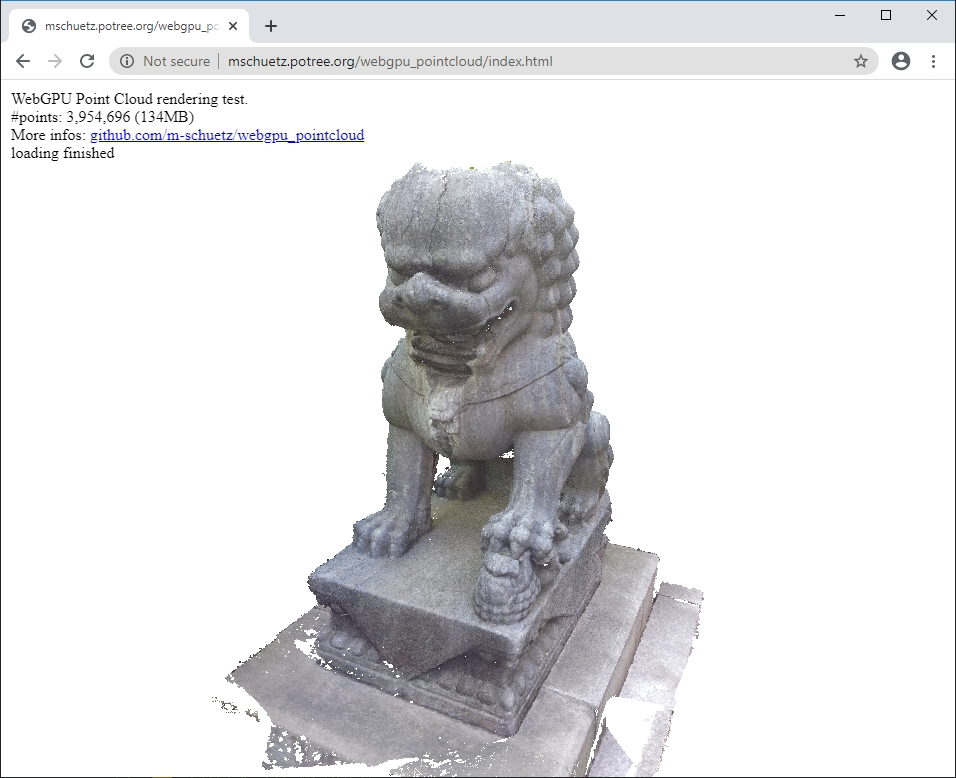

# WebGPU point cloud

A WebGPU point cloud rendering test

* Tested in Chrome Canary 81.0.4031.0 on Windows 10 with the ```chrome://flags/#enable-unsafe-webgpu``` flag enabled. You may also need to update your GPU drivers.
* Code based on cube example from https://github.com/cx20/webgpu-test (MIT license)
* Uses the ```point-list``` primitive topology to render each point as a single pixel. 
* Dataset: 3,954,696 points (134MB)
* The demo loads ~4M points in batches of 100,000 points from an LAS file. 

Demo: http://mschuetz.potree.org/webgpu_pointcloud/index.html

<a href="http://mschuetz.potree.org/webgpu_pointcloud/index.html">
	
</a>
